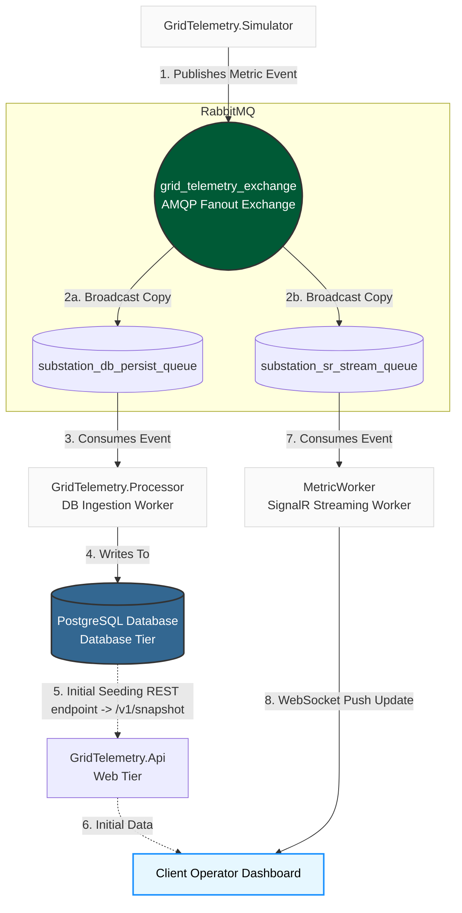
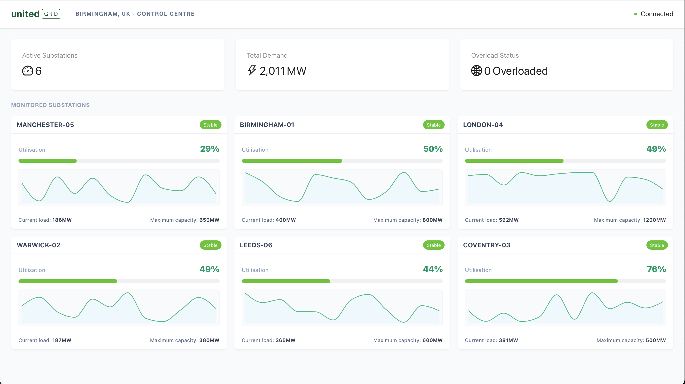
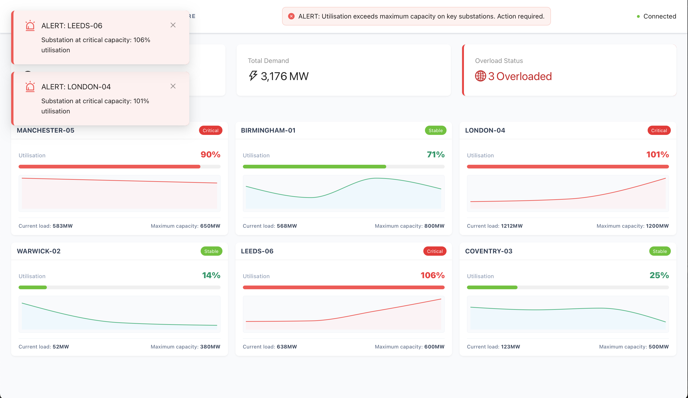

# United Grid Telemetry Ingestion PoC

An real-time, reactive event-driven telemetry ingestion pipeline designed to monitor high-voltage substation load against maximum threshold. Built using a decoupled microservices architecture to ensure horizontal scalability and fault tolerance.

## System Architecture

Utilises an asynchronous Publish/Subscribe pattern to process high-volume substation metrics while minimising bottlenecking risk.



* **Simulation Layer (`GridTelemetry.Simulator`):** A background service simulating a cluster of high-voltage substations, generating real-time load metrics and publishing events to the exchange.
* **Message Broker:** Utilises AMQP Fanout Exchange to broadcast incoming metric events symmetrically across independent, isolated queues.
* **Ingestion Layer (`GridTelemetry.Processor`):** Dedicated worker service consuming from the persistence queue. It processes and writes the event as a record to PostgreSQL.
* **Web Tier & Live Stream (`GridTelemetry.Api`):** Exposes REST endpoints for initial client seeding, hosts an asynchronous SignalR worker to stream real-time events via WebSockets.
* **Operator Dashboard:** A control-centre dashboard tracking utilisation, providing live area-chart sparklines, and managing critical threshold-related overlay alerts .

## Technical Stack & Infrastructure

* **Backend:** .NET 8 / C# (Background Workers, Web API, SignalR)
* **Frontend:** Next.js (App Router, TypeScript, ESLint, TailwindCSS)
* **UI/Data Vis:** Ant Design, Recharts
* **Data Layer:** PostgreSQL
* **Message Ingestion:** RabbitMQ (Advanced Message Queuing Protocol)
* **Containerisation:** Docker & Docker Compose

## Key Engineering Decisions

### 1. Asynchronous Fanout Exchange Pattern
Bypassing direct point-to-point queues ensures total structural decoupling. The database insertion layer (`Processor`) and the user-interface broadcast layer (`Api`) operate on isolated queues. A sudden spike in client dashboard connections will never consume thread pools or delay database write performance.

### 2. Database Query (Group-and-Join)
When the user dashboard first loads, it needs to instantly display the single most recent metric packet for every substation. Pulling every single row from the database into application memory to sort and filter them would be incredibly slow and crash the server as the data grows.

To solve this , the API uses a two-step LINQ query that runs entirely on the database engine:
1. It groups the metrics by substation code to find the single latest timestamp for each asset.
2. It immediately joins those results back to the main table to pull only the full, matching rows.

This ensures that the database does 100% of the filtering work and only sends the exact, relevant snapshot rows over the network, keeping the application fast and lightweight.

### 3. Horizontal Scale-Out Strategy (SignalR Redis Backplane)
In a single-server setup, the .NET hosted service can handle live dashboard streaming. However, scaling the Web tier horizontally across multiple servers introduces a distributed state challenge: when RabbitMQ delivers a message to Node A, any browser clients connected to Node B will miss that update. 

To ensure high availability, the production roadmap introduces a shared Redis Backplane. Instead of changing the message broker layout, all scaled API instances register with a central Redis Pub/Sub channel. When any API instance consumes an event from RabbitMQ, it broadcasts it to the Redis backplane, which automatically distributes the message to all other instances—ensuring all connected operator dashboards receive the real-time stream regardless of the server they are pinned to.

## Run Locally

1. **Spin up Infrastructure via Docker:**
   ```bash
   docker-compose up -d
   ```

2. **Launch the Core Components:**
    Run the following commands in separate terminal split paths from the project root:
    
   ```bash
   dotnet run --project src/backend/GridTelemetry.Api
   dotnet run --project src/backend/GridTelemetry.Processor
   dotnet run --project src/backend/GridTelemetry.Simulator
   ```

3. **Boot the Frontend Client:**

   ```bash
   cd src/frontend
   npm install
   npm run dev
   ```

Navigate to http://localhost:3000 to view the control interface.

## Live System Previews





